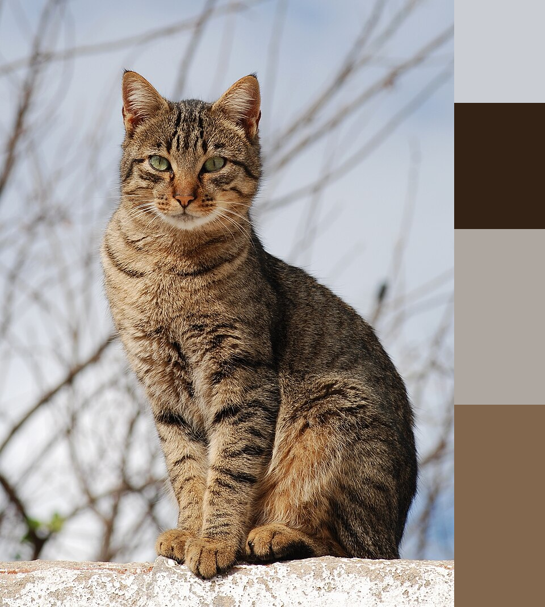
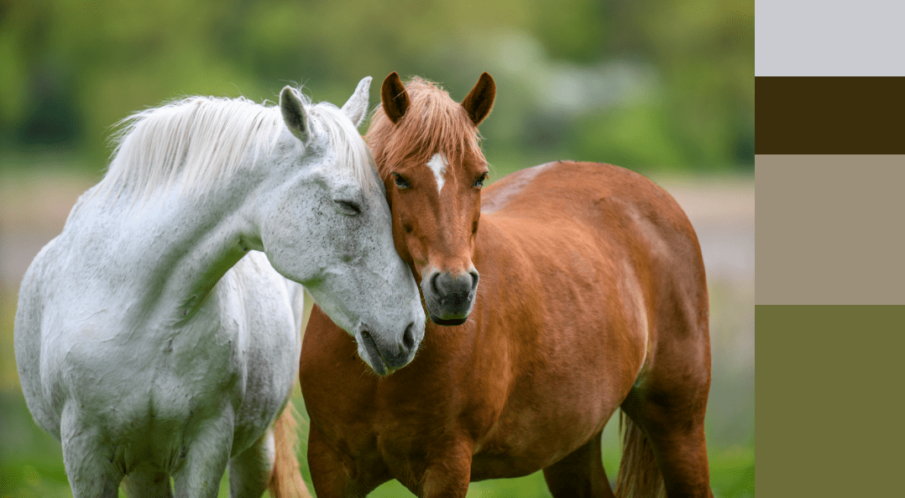

# About

Obtaining a specified number of dominant colors (base colors) in a picture.

Dominant colors are calculated by K-Means clustering.

The result of the calculations is written into a new picture (in the examples the algorithm found 4 dominant colors).

The new picture is in png format.

# Install

Use Dockerfile to build image.

# Usage

## Obtaining information about the dominant colors of a picture
```bash
curl -F file_name=@/path/to/picture --verbose 'http://localhost:8080/info?number_of_clusters=4&max_try_count=30' | json_pp
```

## Finding and drawing dominant colors to a picture
```bash
curl -F file_name=@/path/to/picture -o output.png --verbose 'http://localhost:8080/draw?number_of_clusters=4&max_try_count=30'
```

# Examples

## Cat


## Horses
